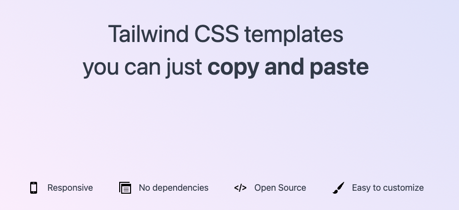

[Tailwind CSS](https://tailwindcss.com) is great for rapidly building websites by allowing you to write your styles right into your HTML. This makes it possible to share HTML templates which contain the styles.

These templates use the default Tailwind CSS configuration so you can just copy paste them into your project and start editing.

All templates are open source and licensed with MIT license.
